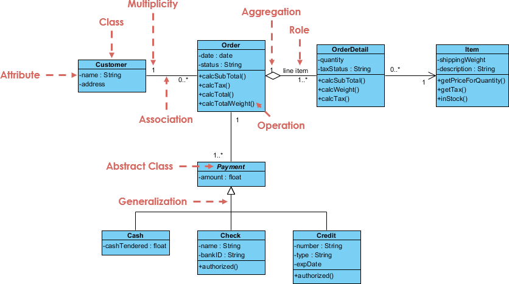

# Models in Agda (Pilot)

This project aims to showcase software modeling with dependent types (Agda) and toy models, and to establish a generalized approach to model common software.

## Toy Models
- [File System](file-systems.agda), [File System - Example](file-systems-example.agda)
- [Order System](order-system.agda), [Order System - Example](order-system-example.agda)
